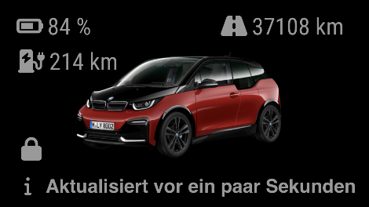

# MMM-MyBMW
Magic Mirror Module to display data from MyBMW for your car(s).

The module displays icons to show lock, charging and battery status, electric and combined range, and total kilometers driven. It also shows the time the MyBMW API last received data from the car.

If you own several BMW cars, you can configure a module for each of them. The module configuration requires the vin number of the car to separate multiple module instances.

The module is heavily based on [MMM-BMWConnected](https://github.com/jannekalliola/MMM-BMWConnected) by [Howard Durdle](https://github.com/hdurdle) and [Janne Kalliola](https://github.com/jannekalliola) and uses [bimmer_connected](https://github.com/bimmerconnected/bimmer_connected) to query the MyBMW API.

## Requirements

**A working python 3 distribution with pip is required before the installation.**

## Installation

Clone this repository in your modules folder, and install dependencies:

    cd ~/MagicMirror/modules
    git clone https://github.com/Jargendas/MMM-MyBMW.git
    cd MMM-MyBMW
    npm install 

## Configuration

Go to the MagicMirror/config directory and edit the config.js file. Add the module to your modules array in your config.js.

You'll need your MyBMW email and password, and your car's VIN number.

Additionally, an hCaptcha token is required on first startup. The session data will be saved afterwards, so it should only be required once. You can generate this token [here](https://bimmer-connected.readthedocs.io/en/stable/captcha/north_america.html) for North America or [here](https://bimmer-connected.readthedocs.io/en/stable/captcha/rest_of_world.html) for the rest of the world.

Enter these details in the config.js for your MagicMirror installation:

        {
            module: "MMM-MyBMW",
            position: "top_right",
            config: {
                email: "email@example.com",
                password: "myComplexPassword",
                vin: "XXXXXXXXXXXXXXXXX",
                hCaptchaToken: "<token>",
            }
        },

## Module configuration
The module has a few configuration options:

<table>
  <thead>
    <tr>
      <th>Option</th>
      <th>Description</th>
    </tr>
  </thead>
  <tbody>
    <tr>
      <td><code>email</code></td>
      <td>Your email for the MyBMW platform, required.  <strong>Default: </strong><code>undefined</code></td>
    </tr>
    <tr>
      <td><code>password</code></td>
      <td>Your password for the MyBMW platform, required.  <strong>Default: </strong><code>undefined</code></td>
    </tr>
    <tr>
      <td><code>vin</code></td>
      <td>Your car's VIN code, required.  <strong>Default: </strong><code>undefined</code></td>
    </tr>
    <tr>
      <td><code>hCaptchaToken</code></td>
      <td>An hCaptcha token for authentication, required on first startup. Can be generated <a href="https://bimmer-connected.readthedocs.io/en/stable/captcha/north_america.html">here</a> for North America or <a href="https://bimmer-connected.readthedocs.io/en/stable/captcha/rest_of_world.html">here</a> for the rest of the world.  <strong>Default: </strong><code>''</code></td>
    </tr>
    <tr>
      <td><code>region</code></td>
      <td>Must be set to the region your car is operating in, required for the MyBMW API. Can be <code>us</code>, <code>cn</code>, or <code>rest</code>.  <strong>Default: </strong><code>rest</code></td>
    </tr>
    <tr>
      <td><code>refresh</code></td>
      <td>How often to refresh the data in minutes.    Be careful: BMW limits the amount of calls per account per day (to ~200 ?), so don't set this value too low.  <strong>Default: </strong><code>15</code></td>
    </tr>
    <tr>
      <td><code>vehicleOpacity</code></td>
      <td>The opacity of the car image. Between 0 and 1.  <strong>Default: </strong><code>0.75</code></td>
    </tr>
    <tr>
      <td><code>useUSUnits</code></td>
      <td>If true, miles instead of kilometres are shown for all range values.   <strong>Default: </strong><code>false</code></td>
    </tr>
    <tr>
      <td><code>showMileage</code></td>
      <td>Whether to show the mileage.   <strong>Default: </strong><code>true</code></td>
    </tr>
    <tr>
      <td><code>showElectricRange</code></td>
      <td>Whether to show the electric range. Will be hidden automatically if electric range is zero (i.e. when car is not electric).  <strong>Default: </strong><code>true</code></td>
    </tr>
    <tr>
      <td><code>showElectricPercentage</code></td>
      <td>Whether to show the battery charging also in percentages. Will be hidden automatically if electric range is zero (i.e. when car is not electric).  <strong>Default: </strong><code>true</code></td>
    </tr>
    <tr>
      <td><code>showFuelRange</code></td>
      <td>Whether to show the fuel range. Will be hidden automatically if fuel range is zero (i.e. when car is  electric).   <strong>Default: </strong><code>true</code></td>
    </tr>
    <tr>
      <td><code>showLastUpdated</code></td>
      <td>Whether to show the info when the data was last updated.   <strong>Default: </strong><code>true</code></td>
    </tr>
    <tr>
      <td><code>lastUpdatedText</code></td>
      <td>The text to be shown before the last updated timestamp.   <strong>Default: </strong><code>last updated</code></td>
    </tr>
    <tr>
      <td><code>authStorePath</code></td>
      <td>Path to store the auth data to for future access without a new hCaptcha token.   <strong>Default: </strong><code>modules/MMM-MyBMW/mybmw_auth.json</code></td>
    </tr>
  </tbody>
</table>

## Changelog

**2024-03-12** Forked from MMM-BMWConnected and migrated to MyBMW via bimmer_connected. 
**2024-12-30** Implemented hCaptcha handling which is now required for bimmer_connected operation.
